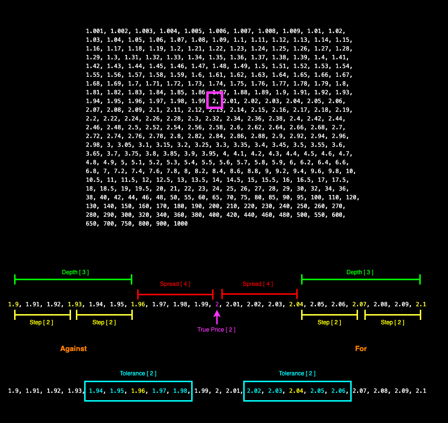

# Seed Calculator

When applying liquidity to a market on The Monaco Protocol, market makers need to apply a spread of prices (odds) with set stake and risk amounts in order to avoid unmanageable liabilities.

The seed calculator takes in seeding parameters in order to generate for (back) and against (lay) prices with their relevant stake amounts in order to apply an even spread of liquidity.

All values are rounded to 2 decimal places.

# Parameters

- **True Price**
  - The the mid-point on a market between _for_ and _against_ orders, all prices are calculated from this point on the price ladder.
- **Spread**
  - The first price on either side of the ladder from the true price.
- **Steps**
  - How many rungs up or down the ladder until the next price is determined.
- **To Return**
  - Amount to be returned from your _for_ order.
- **To Lose**
  - Amount to be returned from your _against_ order.
- **Include Stake in Returns** (true/false)
  - Whether or not to include the stake/risk in the return calculations.
- **Depth Percentages**
  - Percentage of stake to place.
  - For example `[100, 75, 50]` will use `100%, 75%, 50%` of the calculated stake.
  - The number of percentages here also determines the `depth` of the pricing.
- **Price Ladder** (optional)
  - The calculator provides prices based on the default Monaco Protocol price ladder, but custom price ladders can be provided.
- **Price Tolerance** (optional)
  - How many rungs up and down the ladder the current price on the market can deviate before you would want to reconfigure the true price for seeding. By default this is the same value as **steps**.

# Pricing Example

- True price `2`
- Spread `4`
- Steps `2`
- Depth `3`
  - e.g. a depth percentage of `[100, 100, 100]`
- Price tolerance `2` inferred from steps



# Stake Examples

With the same pricing as above:

- To return `100`
- To risk `100`
- Depth percentages `[100, 100, 100]`

## For Seeds (exclude stake)

- Stake `96.15` @ price `2.04` offering a return of `196.15`
- Stake `93.46` @ price `2.07` offering a return of `193.46`
- Stake `90.91` @ price `2.01` offering a return of `190.91`

## Against Seeds (exclude stake)

- Stake `104.17` @ price `1.96` risking `99.83` offering a return of `204.17`
- Stake `107.53` @ price `1.93` risking `99.47` offering a return of `207.53`
- Stake `111.111` @ price `1.9` risking `99.89` offering a return of `211.11`

## For Seeds (include stake)

- Stake `49.02` @ price `2.04` offering a return of `100`
- Stake `48.31` @ price `2.07` offering a return of `100`
- Stake `47.62` @ price `2.01` offering a return of `100`

## Against Seeds (include stake)

- Stake `51.02` @ price `1.96` risking `47.98` offering a return of `100`
- Stake `51.81` @ price `1.93` risking `47.19` offering a return of `100`
- Stake `52.63` @ price `1.9` risking `46.37` offering a return of `100`

## For Seeds - depth percentages of [100, 50, 25] (include stake)

- Stake `49.02` @ price `2.04` offering a return of `100`
- Stake `24.15` @ price `2.07` offering a return of `50`
- Stake `11.9` @ price `2.01` offering a return of `25`

## Against Seeds - depth percentages of [100, 50, 25] (include stake)

- Stake `51.02` @ price `1.96` risking `47.98` offering a return of `100`
- Stake `25.91` @ price `1.93` risking `24.09` offering a return of `50`
- Stake `13.16` @ price `1.9` risking `11.84` offering a return of `25`

# Code Example

```
import { SeedManager } from "@monaco-protocol/seed-calculator";

const truePrice = 2;
const spread = 4;
const steps = 2;
const toReturn = 100;
const toLose = 100;
const includeStakeInReturns = true;
const depthPercentages = [100, 50, 25];
const withinAgainstTolerance = 2.06;
const outsideForTolerance = 1.93;
const manager = SeedManager.initialize(
  truePrice,
  spread,
  steps,
  toReturn,
  toLose,
  includeStakeInReturns,
  depthPercentages
);
console.log("FOR\n");
manager.forSeeds.map((seed) => {
  console.log(JSON.stringify(seed));
});
console.log("\nAGAINST\n");
manager.againstSeeds.map((seed) => {
  console.log(JSON.stringify(seed));
});
console.log(
  `\nIs price ${outsideForTolerance} within FOR tolerance? ${manager.checkForTolerance(
    outsideForTolerance
  )}`
);
console.log(
  `Is price ${withinAgainstTolerance} within AGAINST tolerance? ${manager.checkForTolerance(
    withinAgainstTolerance
  )}`
);

```
